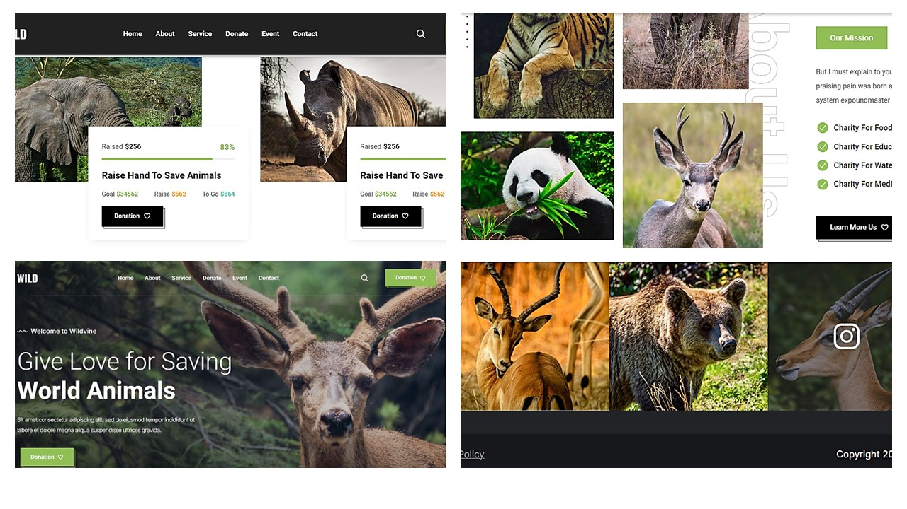

<div align="center">

  <h1 align="center">🐼Wildvine - We are here to stand for wildworld...🐼</h1>

  Wildvine is fully responsive animal charity website, <br /> The website is available in both front-end as well as back-end formats and contains all necessary data

<br>

  <a href=""><strong> 📺 Live</strong></a> 

</div>

<br />

### ☑ Preview



### ☑ Requisites

Before you begin, ensure you have met the following requirements:

* [Git](https://git-scm.com/downloads "Download Git"), [Python](https://www.python.org/downloads/), [Docker](https://www.docker.com/products/docker-desktop/) must be installed on your operating system.

<br>

### ☑ Run 

<br>

🟢 To run **Wildvine** with docker-compose, run this command:

<br>

⭐ Move to folder_name:

```bash
cd folder_name
```
⭐ Install requirements:

```bash
pip install -r requirements.txt
```
⭐ To start project with docker:

```bash
docker-compose up --build
```

<br>


### ☑ Technologies used

<br>

<div align="center">


</div>

<br>

### ☑ Contact

If you want to contact me, you can reach me over [Facebook](https://www.facebook.com/profile.php?id=61552988346259&mibextid=ZbWKwL), [Instagram](https://www.instagram.com/uluxanova_.a?igsh=d28zMW50ZXU0Z3Ny), [Linkedin](https://www.linkedin.com/in/ay%C5%9F%C9%99-u-8b37b8219?utm_source=share&utm_campaign=share_via&utm_content=profile&utm_medium=android_app)

<br>

### ☑ License

This project is licensed by [MIT](https://choosealicense.com/licenses/mit/) and contains respective license information


<br>

### ☑ Creators

The project got prepared by collaborative actions of [Sahil](https://github.com/salahlisahil) , [Aleksey](https://github.com/alexop89056), and [Aisha](https://github.com/AysheUlukhan)

<br>

<div align="center">
  
  
  
  
  [](https://youtube.com)
  


</div>
